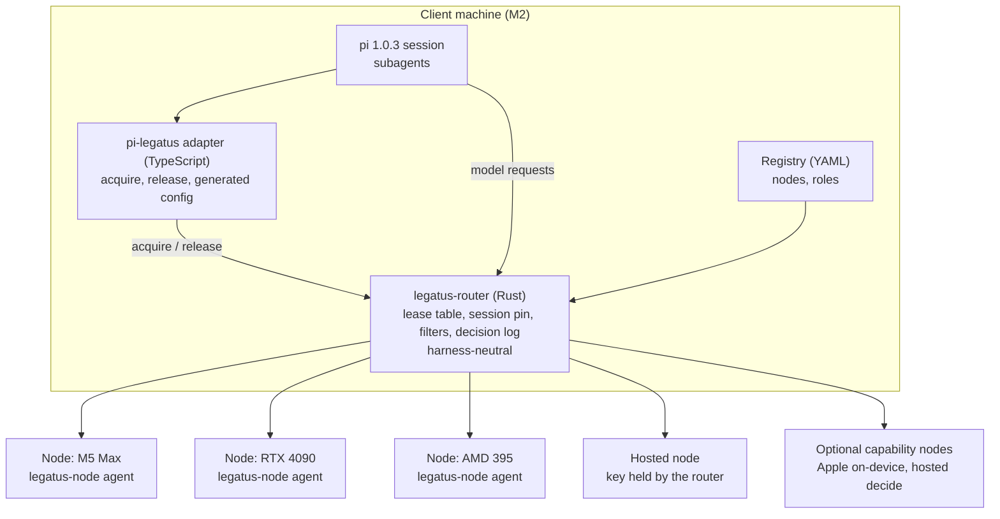

# Technical architecture

All orchestration runs on the client machine; other machines only serve inference. The router is harness-neutral and holds the lease table; the harness is reached through a thin per-harness adapter, and pi 1.0.3 is the first. See the [scope reset](../decisions/2026-10-scope-reset.md) for what is out of scope.

## Layers

1. **Harness.** A pi session. Subagents are the harness's own business; Legatus sees only the model requests they send and the acquire and release calls.
2. **Adapter.** `pi-legatus`, a thin TypeScript extension plus a config generator. It gives the harness three things: a model endpoint with the role string and the right protocol, a stable session identity, and acquire and release of an LLM lease. See [LLM pool allocation](coordination.md). Other harnesses are later adapters with the same surface.
3. **Router.** `legatus-router`, a Rust proxy, fronts every node. It holds the lease table and the session pin, applies the capability, endpoint-kind, health and context filters, guards against silent truncation, keeps a decision log, and records an outcome for every request. It serves OpenAI chat-completions and Anthropic Messages, one protocol per role, without translating between them. See [dispatcher](dispatcher.md).
4. **Registry.** One YAML file, the source of truth for nodes, roles and (PROPOSED) machines. See [registry](registry.md).
5. **Nodes.** Each machine runs whatever engine suits it (llama.cpp, MLX, Ollama, vLLM, SGLang), optionally behind llama-swap or llama-server router mode. A node is described by a model card, a server card and a measured profile (see [registry](registry.md#nodes-three-layers)). A hosted node is just a node whose key the router holds. An optional `legatus-node` agent on each machine reports health, load and machine readings (power and thermal) uniformly.

## Harness-neutral boundary

| Component | Scope | Why |
| --- | --- | --- |
| `legatus-router` | Harness-neutral | Speaks the wire protocols; any harness that can set a base URL uses it |
| `legatus-node` | Harness-neutral | Reports on the machine; knows nothing of harnesses |
| Adapter | Per-harness | Emits the harness's provider config from the registry and exposes acquire and release |

pi 1.0.3 (`@earendil-works/pi-coding-agent`; the `@mariozechner` package is deprecated) is the first adapter, chosen for its very light system prompt. Claude Code, opencode and DeepSeek Harness are later adapters; see the [roadmap](roadmap.md). The spikes found that Claude Code speaks only Anthropic Messages and completed a tool loop through the router on llama-server, and that DeepSeek Harness sends no session header on its chat and Anthropic routes.

**Engine and version rule.** Every claim about an engine or harness carries the version it was seen on. Engines are frozen during tests (Ollama auto-updates), versions are pinned, and every pin is re-checked before a release.

## Process model

The router and node agents are long-lived processes. The adapter runs inside the harness process. pi-subagents (0.76.0) foreground children run in the parent's process; async and workflow children are separate processes, with no per-run environment variables. Legatus does not spawn or supervise any of them: it keys on the session identity the adapter provides and on the lease id.

## Boundaries and protocols

| Boundary | Standard | Status |
| --- | --- | --- |
| Harness to model | OpenAI Chat Completions, Anthropic Messages | Works today |
| Adapter to router | HTTP JSON on the router admin listener (lease acquire, release, list) | PROPOSED |
| Router to node agent | HTTP, polled | PROPOSED |
| Repo instructions | AGENTS.md | Works today |

## Credential custody

The network is assumed to be a trusted local one; Legatus does not own network-level security. The key of a hosted or frontier node is held by the router only. Agents never see it; they send a placeholder token. The router's own logs must not contain the key.

## Failure modes

Rule: Legatus does not hide an endpoint failure in v1. It reports it to the agent, which deals with it or not.

| Failure | Effect | Behaviour |
| --- | --- | --- |
| Router down | No model calls and no leases | Acquire fails fast with a clear error; running agents' requests fail. |
| Router restarts | In-memory state lost | Pins and leases are replayed from the journal; surviving leases get one fresh idle TTL. |
| Node down or unhealthy | Requests to it fail | A node that fails its health check is filtered out of new acquires. A request to a leased or pinned node that is down returns the error to the agent. The lease does not move. Resilience is v2+; see [dispatcher](dispatcher.md#v2-resilience). |
| Node hangs | The harness waits for its own request timeout | Not handled in v1. The spike saw pi hold for 300 s and retry the same node. |
| Node truncates a prompt silently | Reply based on a cut prompt, HTTP 200 | Router truncation guard and streaming input-token check; see [dispatcher](dispatcher.md#protecting-against-silent-truncation). |
| No capacity or no candidate | Acquire cannot be granted | Refused with the reason; see [LLM pool allocation](coordination.md#failure-modes). |
| Node agent unreachable | No load or machine readings | The router falls back to its own in-flight count and the engine's own signals. |
| Client machine sleeps | Orchestration stops | Leases lapse by idle TTL and maximum lifetime. |

## Parameters

Named values used across these docs. Defaults are reasoned starting points, not measurements; tune them against the acceptance tests in the [roadmap](roadmap.md).

| Parameter | Default | Used for |
| --- | --- | --- |
| `LOAD_POLL_INTERVAL_S` | 2 | Queue and load polling |
| `HEALTH_POLL_INTERVAL_S` | 10 | Active node up/down polling |
| `SMOKE_CALLS` | 50 | Calls in the tool-call smoke test |
| `SMOKE_MIN_PASS` | 0.95 | Pass fraction required to join a role |
| `SMOKE_MIN_VALID_JSON` | 1.0 | Fraction of tool calls whose arguments must parse and match the schema |
| `OUTPUT_TOKEN_ESTIMATE_DEFAULT` | 8192 | Expected output when a role gives none; a role may override it |

Lease parameters, PROPOSED (no values chosen; defined in [LLM pool allocation](coordination.md#parameters-proposed)).

| Parameter | Used for |
| --- | --- |
| `LEASE_IDLE_TTL_S` | Lease ends after this long with no requests |
| `LEASE_MAX_LIFETIME_S` | Upper bound on any lease |
| `SESSION_PIN_IDLE_TTL_S` | Idle expiry of the implicit pin |

Calibration parameters, proposed from values the spikes actually used. They are starting points only, and untested beyond the spike hardware.

| Parameter | Proposed | Used for |
| --- | --- | --- |
| `CALIBRATION_TTFT_SAMPLES` | 8 | Short requests for time-to-first-token percentiles |
| `CALIBRATION_PREFILL_TOKENS` | 500, 2000, 6000, 12000 | Prompt sizes for the prefill rate and the sentinel truncation check |
| `CALIBRATION_CONCURRENCY_LEVELS` | 1, 2, 4, 8 | Levels for the throughput curve and useful concurrency |
| `CALIBRATION_USEFUL_CONCURRENCY_FRACTION` | 0.9 | Useful concurrency is the lowest level reaching this fraction of peak throughput |
| `CALIBRATION_MIN_THINKING_MAX_TOKENS` | 400 | Output limit for the sentinel check on thinking models |
| `CALIBRATION_LIGHT_INTERVAL_S` | 3600 | Light re-probe period (proposed in the capability research; not run) |

The timeout, breaker, failover and retry parameters, the lease-renewal and guard parameters, and the budget parameters belonged to removed or deferred features; they are in the [archive](../archive/).
