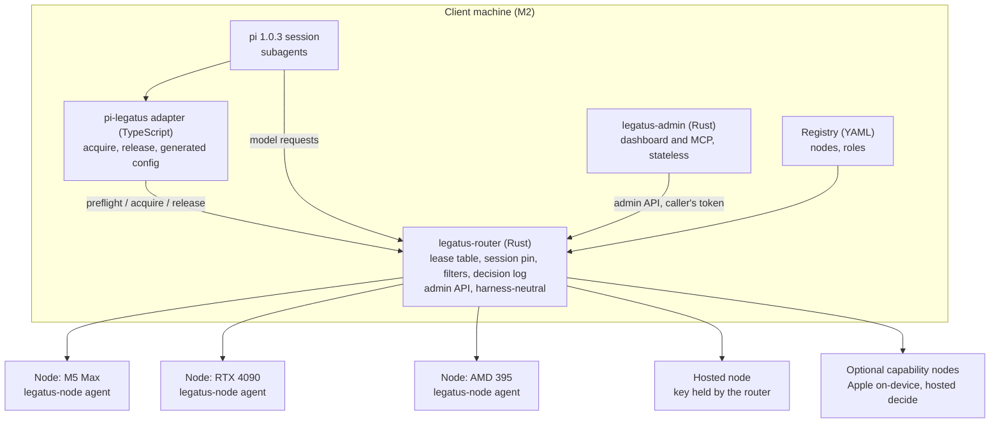

# Technical architecture

All orchestration runs on the client machine; other machines only serve inference. The router is harness-neutral and holds the lease table; the harness is reached through a thin per-harness adapter, and pi 1.0.3 is the first. See the [scope reset](../decisions/2026-10-scope-reset.md) for what is out of scope.

## Layers

1. **Harness.** A pi session. Subagents are the harness's own business; Legatus sees only the model requests they send and the preflight, acquire and release calls the main agent makes (explicit in v1; automatic interception of the spawn call is post-v1).
2. **Adapter.** `pi-legatus`, a thin TypeScript extension plus a config generator. It gives the harness three things: a model endpoint with the role string and the right protocol, a stable session identity, and acquire and release of an LLM lease (the tools `can_spawn`, `request_llm`, `release_llm`). The three-capability adapter contract lives in its own package, `packages/adapter-contract` (`@legatus/adapter-contract`), which every adapter imports. See [LLM pool allocation](coordination.md). Other harnesses are later adapters with the same surface.
3. **Router.** `legatus-router`, a Rust proxy, fronts every node. It holds the lease table and the session pin, serves the versioned admin API, applies the capability, endpoint-kind, health and context filters, guards against silent truncation, keeps a decision log, and records an outcome for every request (one upstream call site, one tap, one recorded outcome per request; none acted on in v1). It logs metadata only, never prompt or completion text. It serves OpenAI chat-completions and Anthropic Messages, one protocol per role, without translating between them. See [dispatcher](dispatcher.md).
4. **Registry.** One YAML file, the source of truth for nodes, roles and (PROPOSED) machines. See [registry](registry.md).
5. **Nodes.** Each machine runs whatever engine suits it (llama.cpp, MLX, Ollama, vLLM, SGLang), optionally behind llama-swap or llama-server router mode. A node is described by a model card, a server card and a measured profile (see [registry](registry.md#nodes-three-layers)). A hosted node is just a node whose key the router holds. An optional `legatus-node` agent on each machine reports health, load and machine readings (power, temperature, throttling) uniformly; it owns those readings for its machine. The behavioural-telemetry stories only record and report them.

## Admin surface

The admin surface is the epic `admin-surface` (stories 95 to 99). PROPOSED, mostly unbuilt.

- **API.** The router serves a versioned admin API under `/legatus/v1/` (one contract, with registries for routes, metrics and dashboard panels, so a new epic adds rows and not conventions). Read routes change no state, even a `POST` such as the capacity preflight. Admin reads never return holder or session values; they carry a label and a non-reversible `holder_ref`.
- **Control surface in v1 is lease acquire and release, nothing more.** Table reload, drain, and calibration or canary runs were dropped. No route exists as a placeholder: the registry lists only routes that are built, and the dashboard shows only panels for live epics.
- **Auth and audit.** A token is always required, also on loopback. Two scopes: `read`, and `control` (which includes read). Tokens live in an owner-only file as hashes. Every control attempt, allowed or refused, is written to an audit log. A lease-only token scope, so an adapter need not hold a full control token, is a paused backburner story in the security epic; until then an adapter that acquires holds a control token (an honest weakness).
- **Process.** The dashboard and the MCP server run in a separate, small, stateless process, `legatus-admin`, which is a thin client of the router API and forwards the caller's own bearer token; it holds no secret and no cache. The router gets no dashboard assets and no MCP code. If `legatus-admin` is down, the dashboard and MCP are down and nothing else: the harness lease path never depends on it. Its footprint is NOT MEASURED.
- **One admin story and one MCP story per live epic.** No AppleScript API (owner decision).
- **Unproven (ASSUMPTION, NOT TESTED).** The MCP library choice (hand-written minimal server or a pinned library, settled by a spike against pi 1.0.3), pi's MCP client against this server, and the dashboard stack.

## Harness-neutral boundary

| Component | Scope | Why |
| --- | --- | --- |
| `legatus-router` | Harness-neutral | Speaks the wire protocols; any harness that can set a base URL uses it |
| `legatus-node` | Harness-neutral | Reports on the machine; knows nothing of harnesses |
| `legatus-admin` | Harness-neutral | Dashboard and MCP over the router's admin API; stateless |
| Adapter | Per-harness | Emits the harness's provider config from the registry and exposes the preflight, acquire and release tools |

pi 1.0.3 (`@earendil-works/pi-coding-agent`; the `@mariozechner` package is deprecated) is the first adapter, chosen for its very light system prompt. Claude Code, opencode and DeepSeek Harness are later adapters; see the [roadmap](roadmap.md). The spikes found that Claude Code speaks only Anthropic Messages and completed a tool loop through the router on llama-server, and that DeepSeek Harness sends no session header on its chat and Anthropic routes.

**Engine and version rule.** Every claim about an engine or harness carries the version it was seen on. Engines are frozen during tests (Ollama auto-updates), versions are pinned, and every pin is re-checked before a release.

## Process model

The router, `legatus-admin` and node agents are long-lived processes. The adapter runs inside the harness process. pi-subagents (0.76.0) foreground children run in the parent's process; async and workflow children are separate processes, with no per-run environment variables. Legatus does not spawn or supervise any of them: it keys on the session identity the adapter provides (one value in `x-session-affinity`, `session#agent` where the harness has agent ids) and on the lease id.

## Boundaries and protocols

| Boundary | Standard | Status |
| --- | --- | --- |
| Harness to model | OpenAI Chat Completions, Anthropic Messages | Works today |
| Adapter to router | HTTP JSON on the router admin listener (`/legatus/v1/`: preflight, lease acquire, release, list); the address is `admin_addr` in the registry `router` section | PROPOSED |
| Dashboard and MCP to router | The same admin API, through `legatus-admin`, with the caller's bearer token; the listener is `admin_ui_addr` | PROPOSED |
| Router to node agent | HTTP, polled | PROPOSED |
| Repo instructions | AGENTS.md | Works today |

## Credential custody

The network is assumed to be a trusted local one; Legatus does not own network-level security. The key of a hosted or frontier node is held by the router only. Agents never see it; they send a placeholder token. The router's own logs must not contain the key. On a request to a hosted node the router strips every `x-legatus-*` header (lease, request id, consent, shipping, user) as well as `x-session-affinity`, so none reaches a provider.

## Failure modes

Rule: Legatus does not hide an endpoint failure in v1. It reports it to the agent, which deals with it or not.

| Failure | Effect | Behaviour |
| --- | --- | --- |
| Router down | No model calls and no leases | Acquire fails fast with a clear error; running agents' requests fail. |
| Router restarts or crashes | In-memory state lost | Pins and leases are replayed from the journal; surviving leases get one fresh idle TTL. The router listens early and serves after replay, starts degraded on a bad file, and refuses a second instance. This is resilience of Legatus's own state, not the paused v2 router resilience. See [LLM pool allocation](coordination.md#persistence-and-restart). Restart-to-ready time is NOT MEASURED. |
| Lease ended by TTL while the agent was in a long tool run | Next request fails | `lease_ended` (HTTP 409); no fallback to the session pin. See [LLM pool allocation](coordination.md#failure-modes). |
| Node down or unhealthy | Requests to it fail | A node that fails its health check is filtered out of new acquires. A request to a leased or pinned node that is down returns the error to the agent. The lease does not move. Resilience is v2+; see [dispatcher](dispatcher.md#v2-resilience). |
| Node hangs | The harness waits for its own request timeout | Not handled in v1. The spike saw pi hold for 300 s and retry the same node. |
| Node truncates a prompt silently | Reply based on a cut prompt, HTTP 200 | Pre-send prompt-token guard (may return 400); the streaming input-token check only logs and records, and a bound request returns the error. No ping injection and no stream normaliser. See [dispatcher](dispatcher.md#protecting-against-silent-truncation). |
| No capacity or no candidate | Acquire cannot be granted | Refused with the reason; see [LLM pool allocation](coordination.md#failure-modes). |
| Node agent unreachable | No load or machine readings | The router falls back to its own in-flight count and the engine's own signals. |
| Client machine sleeps | Orchestration stops | Sleep and wake are not counted as idle. Which macOS clock survives sleep is OPEN and NOT TESTED. |
| Leased node restarts | Requests fail until it is back | The lease stays and does not move; the error goes to the agent. |
| `legatus-admin` down | No dashboard, no MCP tools | Nothing else is affected; pi starts without the MCP tools if it is down at harness start. |

## Parameters

Named values used across these docs; story 9 owns the catalogue. Defaults are reasoned starting points, not measurements; tune them against the acceptance tests in the [roadmap](roadmap.md). A catalogue entry exists only for a parameter a live story uses.

| Parameter | Default | Used for |
| --- | --- | --- |
| `LOAD_POLL_INTERVAL_S` | 2 | Queue and load polling |
| `HEALTH_POLL_INTERVAL_S` | 10 | Active node up/down polling |
| `SMOKE_CALLS` | 50 | Calls in the tool-call smoke test |
| `SMOKE_MIN_PASS` | 0.95 | Pass fraction required to join a role |
| `SMOKE_MIN_VALID_JSON` | 1.0 | Fraction of tool calls whose arguments must parse and match the schema |
| `OUTPUT_TOKEN_ESTIMATE_DEFAULT` | 8192 | Expected output when a role gives none; a role may override it |

Lease parameters, PROPOSED defaults, not measurements (defined in [LLM pool allocation](coordination.md#parameters-proposed)).

| Parameter | Default | Used for |
| --- | --- | --- |
| `LEASE_IDLE_TTL_S` | 1800 | Lease ends after this long with no requests |
| `LEASE_MAX_LIFETIME_S` | 14400 | Upper bound on any lease |
| `SESSION_PIN_IDLE_TTL_S` | 3600 | Idle expiry of the implicit pin |

`ENDED_LEASE_HISTORY` (200) is a constant, not a catalogue parameter. The queue thresholds of the earlier selection draft were removed with the overflow rule; the single selection rule needs none.

Other live parameters, with values where the stories propose one (all PROPOSED): `DECISION_LOG_MAX_ENTRIES` 10000, `LOAD_STALE_AFTER_POLLS` 3, `SILENT_TRUNCATE_USABLE_FRACTION` 0.5, `TRUNCATION_ALLOWED_SHORTFALL` 0.1, `ESTIMATOR_MARGIN_RATIO` 0.1, `BODY_MAX_BYTES_DEFAULT` 8388608, `BODY_MAX_BYTES_TRANSCRIPTION` 104857600, `BODY_MAX_BYTES_IMAGES` 33554432. The measurement timeouts `CONNECT_TIMEOUT_S`, `FIRST_TOKEN_TIMEOUT_BASE_S` and `STREAM_IDLE_TIMEOUT_S` are parameters of the node check, smoke test and calibration, not router timeouts (router timeouts are v2+). Admin-surface parameters (`ADMIN_*`) have no values yet except as placeholders. A parameter used only by a paused or removed feature is not catalogued as live.

Calibration parameters, proposed from values the spikes actually used. They are starting points only, and untested beyond the spike hardware. Story 59 owns them.

| Parameter | Proposed | Used for |
| --- | --- | --- |
| `CALIBRATION_TTFT_SAMPLES` | 8 | Short requests for time-to-first-token percentiles |
| `CALIBRATION_PREFILL_TOKENS` | 500, 2000, 6000, 12000 | Prompt sizes for the prefill rate and the sentinel truncation check |
| `CALIBRATION_CONCURRENCY_LEVELS` | 1, 2, 4, 8 | Levels for the throughput curve and useful concurrency |
| `CALIBRATION_USEFUL_CONCURRENCY_FRACTION` | 0.9 | Useful concurrency is the lowest level reaching this fraction of peak throughput |
| `CALIBRATION_MIN_THINKING_MAX_TOKENS` | 400 | Output limit for the sentinel check on thinking models |
| `CALIBRATION_LIGHT_INTERVAL_S` | 3600 | Light re-probe period (proposed in the capability research; not run) |

27 placeholder defaults in the stories were chosen by agents, not measured or decided by the owner; they are listed as an open item in the [decision record](../decisions/2026-10-scope-reset.md#open-items-after-the-first-cross-check). The timeout, breaker, failover and retry parameters, the lease-renewal and guard parameters, and the budget parameters belonged to removed or deferred features; they are in the [archive](../archive/).
