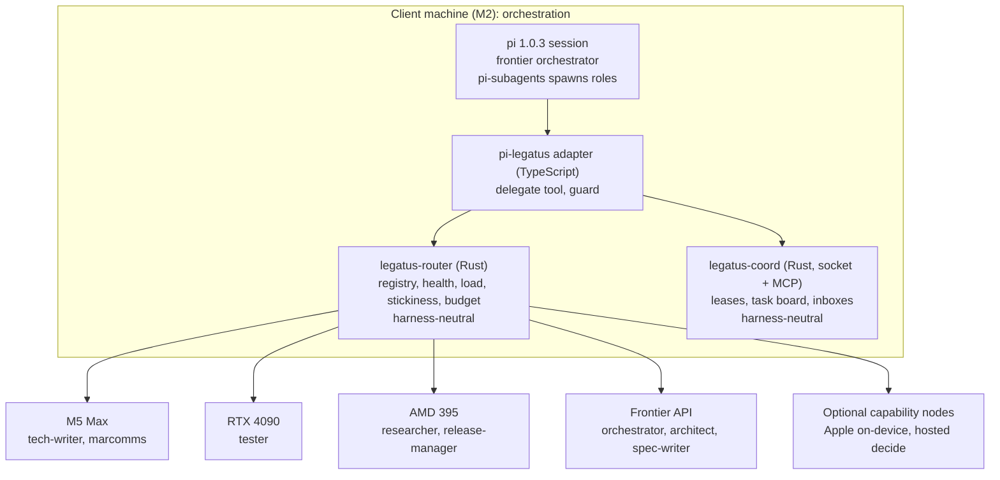

# Technical architecture

All orchestration runs on the client machine; other machines only serve inference. Four layers sit between the person and the models, with a coordination service alongside. The router and coord are harness-neutral; the harness itself is reached through a thin per-harness adapter, and pi 1.0.3 is the first.

Role placements are first preferences; each role falls back down its candidate list.

## Layers

1. **Harness.** A pi session with a frontier model as orchestrator. pi-subagents runs each role as a subagent with its own model and permissions. Foreground subagents run inside the parent's process; async and workflow children are separate processes (see [process model](#process-model)).
2. **Dispatcher.** The `delegate(role, task)` tool, a thin pi extension, asks the router which node should serve the role. See [dispatcher](dispatcher.md).
3. **Router.** `legatus-router`, a Rust proxy, fronts every node and the frontier API: capability and health filters, failover, spend caps and session affinity. It serves OpenAI chat-completions and Anthropic Messages, one protocol per role, without translating between them. It replaces an interpreted gateway such as LiteLLM.
4. **Nodes.** Each machine runs whatever engine suits it (llama.cpp, MLX, Ollama, vLLM, SGLang), optionally behind llama-swap or llama-server router mode for local model lifecycle, reachable by the router over the local network. A node is described by a model card, a server card and a measured profile (see [registry](registry.md#nodes-three-layers)). The frontier API and any hosted node are just nodes with a budget. An optional `legatus-node` agent reports health and load uniformly.

Alongside sits the **coordination service**, which every agent reaches for leases on shared resources, a task board and messaging: over a Unix socket from in-process extensions and over loopback MCP from MCP clients (proposed default P-1). See [coordination](coordination.md).

## Harness-neutral boundary

| Component | Scope | Why |
| --- | --- | --- |
| `legatus-router` | Harness-neutral | Speaks the wire protocols; any harness that can set a base URL uses it |
| `legatus-coord` | Harness-neutral | Plain socket and MCP; no harness types |
| Guard | Per-harness adapter | Hooks into each harness's pre-tool-call mechanism |
| `delegate` | Per-harness adapter | Spawns children through each harness's own subagent mechanism |
| Generator | Per-harness adapter | Emits each harness's provider config and agent definitions from the registry |

pi 1.0.3 (`@earendil-works/pi-coding-agent`; the `@mariozechner` package is deprecated) is the first adapter, chosen for its very light system prompt. Claude Code, opencode and DeepSeek Harness are later adapters; see the [roadmap](roadmap.md). The spikes found that Claude Code speaks only Anthropic Messages and completed a tool loop through the router on llama-server, and that DeepSeek Harness covers subagents with one listener but sends no session header on its chat and Anthropic routes.

**Engine and version rule.** Every claim about an engine or harness carries the version it was seen on. Engines are frozen during tests (Ollama auto-updates), versions are pinned, and every pin is re-checked before a release.

## Process model

"One process per role" does not hold for every mode of pi-subagents (0.76.0):

- **Foreground subagents** run in the parent's process and do not load the parent's extensions unless the agent lists them in `extensions:`.
- **Async and workflow children** are separate processes and load the user-level guard.
- There are no per-run environment variables, only a working directory and a small bindings channel, so per-child credentials need that channel or separate launches.

`delegate` uses async children so the orchestrator is not blocked.

## Boundaries and protocols

| Boundary | Standard | Status |
| --- | --- | --- |
| Harness to model | OpenAI Chat Completions, Anthropic Messages | Works today |
| In-process extension to coordination | Unix socket, JSON lines | Proposed default (P-1) |
| Agents to coordination | MCP over loopback streamable HTTP | Proposed default (P-1) |
| Orchestrator to remote subagent | ACP over ssh (`pi-acp`), or an ssh exec tool | `pi-acp` is an editor adapter with no ssh; plan B is the ssh exec tool |
| Repo instructions | AGENTS.md | Works today |
| Agent to independent agent | A2A v1.0 | Optional, later |

## Isolation

Every writing agent gets its own git worktree and branch, enforced as confinement by the guard (a write is allowed only inside the agent's worktree); the release manager merges. Leases cover only what cannot be isolated or merged: shared named resources (a GPU, a test environment) and the release itself.

## Defence in depth

The guard cannot stop a child that was launched without it. In the spikes a textual `-ne` check was evaded and a wrong extension filename left pi running unguarded with exit code 0. Four layers cover each other:

1. **Guard.** A pre-tool-call hook that blocks writes outside the worktree and checks leases; it fails closed and every coord call has its own deadline.
2. **Registration check.** The guard registers with coord at startup, with a self-check that fails loudly; `delegate` verifies registration.
3. **Watcher.** A dispatcher-side process kills a child that never registers (1.2 s in the spike).
4. **Sandbox.** A per-worktree `sandbox-exec` profile on macOS denies writes outside the worktree at the OS level (20 to 40 ms per launch in the spike). It also lets the guard allow commands it cannot classify (`npm test`, `make`). Linux sandboxing is untested.

pi-subagents has no option to wrap a child's command; the spike used a PATH trick that relies on an undocumented fallback.

## Least privilege

The network is assumed to be a trusted local one; Legatus does not own network-level security. Within that, least privilege is enforced at the agent and resource level:

- Each role's `tools` profile is an allow-list; unlisted tools are denied.
- Leases cover the narrowest resource that works (a named resource, not the repo).
- Hosted nodes follow the same rule: the router holds their credentials, and each has a budget cap.
- The frontier API key is held by the router only. Agents never see it.
- A subagent receives only the leases and credentials its task needs, for the task's lifetime.

## Frontier budget

The frontier model, and any hosted pay-per-token node, sits behind the router with a daily spend cap. Behaviour when the cap is reached is defined in [dispatcher](dispatcher.md#frontier-budget-exhaustion). Outputs passed back to the orchestrator are pointers (branch, path, link), so frontier context grows slowly.

## Failure modes

Rule: when a safety-bearing component is unavailable, Legatus fails closed for writes and open for reads. It never bypasses the router or the lease check to keep work moving.

| Failure | Effect | Behaviour |
| --- | --- | --- |
| Router down | No model calls can be routed | `delegate` fails fast with a clear error. Agents do not call nodes directly, so stickiness and the budget cap still hold. Running subagents' calls fail and are reported as blocked. |
| Coord down | No lease checks possible | The guard blocks writes, commits and release commands; reads continue. New delegations are refused. See [coordination](coordination.md#guard-failure-behaviour). |
| Coord down at harness start | MCP tools silently absent and never appear later | The startup self-check detects the missing tools and the harness does not proceed unguarded. Start coord first. |
| Coord call hangs | The harness gives a hook no timeout; one hung call stalled pi for over 70 s | Every guard call has its own deadline and fails closed. |
| Guard fails to load or throws at startup | Harness runs unguarded and exits 0 | Startup self-check, registration check and watcher; sandbox as the last layer. |
| Child launched without the guard | No hook runs | Watcher kills the unregistered child; sandbox denies writes outside the worktree. |
| Child reports done without changes | Board says `done`, nothing happened (seen with a 1.7B model) | Completion requires an acceptance check, not process exit 0. |
| Coord store locked or corrupt | State may be inconsistent | Coord refuses writes and reports the error. Recovery replays the append-only event log; if the log is unreadable, restore the last backup taken at session start. |
| Coord restarts | In-memory state lost | State is rebuilt from the event log. Leases whose TTL lapsed during the outage are expired, never extended. |
| Node down or unhealthy | Requests to it fail | Per-node circuit breaker; see [dispatcher](dispatcher.md#circuit-breaker). A hung node is caught by the mandatory first-byte and idle timeouts. |
| Node truncates a prompt silently | Reply based on a cut prompt, HTTP 200 | Router truncation guard and streaming input-token check; see [dispatcher](dispatcher.md#protecting-against-silent-truncation). |
| Node dies mid-stream | Stream ends part way | No failover after the first byte; the harness retry avoids that node. |
| Frontier API down | Frontier calls fail | Treated as a node failure through the same circuit breaker. Roles with no other candidate block and report. |
| Client machine sleeps | Orchestration stops | All leases lapse by TTL. On wake, coord expires stale leases before any agent resumes. |

## Parameters

Named values used across these docs. Defaults are reasoned starting points, not measurements; tune them against the acceptance tests in the [roadmap](roadmap.md).

| Parameter | Default | Used for |
| --- | --- | --- |
| `LOAD_POLL_INTERVAL_S` | 2 | Queue and load polling |
| `HEALTH_POLL_INTERVAL_S` | 10 | Active node up/down polling. Secondary: request outcomes (passive detection) trip the breaker first. |
| `FAILOVER_MAX_S` | 30 | Longest allowed time from node failure to no new traffic reaching it |
| `CONNECT_TIMEOUT_S` | 5 | Connection to a node |
| `FIRST_TOKEN_TIMEOUT_BASE_S` | 30 | Fixed part of the time-to-first-token timeout |
| `FIRST_TOKEN_TIMEOUT_PER_1K_PROMPT_S` | 1 | Added per 1,000 prompt tokens, for slow prefill |
| `STREAM_IDLE_TIMEOUT_S` | 60 | Longest silence mid-stream before the request fails |
| `BREAKER_FAILURE_THRESHOLD` | 3 | Consecutive failures that open a node's breaker; a timeout counts as a failure |
| `BREAKER_COOLDOWN_S` | 30 | First wait before a probe |
| `BREAKER_COOLDOWN_BACKOFF_FACTOR` | 2 | Cooldown multiplier on each repeat opening |
| `BREAKER_COOLDOWN_MAX_S` | 300 | Cooldown ceiling |
| `BREAKER_PROBE_SUCCESSES` | 2 | Probe successes needed to close the breaker |
| `REQUEST_RETRY_LIMIT` | 1 | Retries of a failed request, on the next candidate |
| `LEASE_TTL_S` | 60 | Default lease lifetime |
| `LEASE_RENEW_FRACTION` | 1/3 | Hook renews when this fraction of TTL remains |
| `HOOK_CACHE_TTL_S` | `LEASE_TTL_S` × `LEASE_RENEW_FRACTION` | Maximum age of the hook's cached lease state |
| `NEGOTIATION_MAX_ROUNDS` | 4 | Messages between two agents about one resource before escalation |
| `SMOKE_CALLS` | 50 | Calls in the tool-call smoke test |
| `SMOKE_MIN_PASS` | 0.95 | Pass fraction required to join a role |
| `SMOKE_MIN_VALID_JSON` | 1.0 | Fraction of tool calls whose arguments must parse and match the schema |
| `SESSION_BUDGET_FRACTION` | 0.25 | Largest share of `budget_gbp_day` one session may spend |
| `OUTPUT_TOKEN_ESTIMATE_DEFAULT` | 8192 | Expected output when a role gives none; a role may override it |

Proposed parameters, taken from values the spikes actually used. They are starting points only, and untested beyond the spike hardware.

| Parameter | Proposed | Used for |
| --- | --- | --- |
| `COORD_CALL_DEADLINE_S` | 1.5 | Guard's own deadline on every coord call (the spike used 1500 ms) |
| `GUARD_HEARTBEAT_INTERVAL_S` | 10 | Guard's renewal timer (the spike used 10 s). Note the spike's cache was 5 s, shorter than the 20 s `HOOK_CACHE_TTL_S` derived above |
| `HOOK_CACHE_EXPIRY_MARGIN_S` | 0.5 | A cached decision is capped at lease expiry minus this |
| `CALIBRATION_TTFT_SAMPLES` | 8 | Short requests for time-to-first-token percentiles |
| `CALIBRATION_PREFILL_TOKENS` | 500, 2000, 6000, 12000 | Prompt sizes for the prefill rate and the sentinel truncation check |
| `CALIBRATION_CONCURRENCY_LEVELS` | 1, 2, 4, 8 | Levels for the throughput curve and useful concurrency |
| `CALIBRATION_USEFUL_CONCURRENCY_FRACTION` | 0.9 | Useful concurrency is the lowest level reaching this fraction of peak throughput |
| `CALIBRATION_MIN_THINKING_MAX_TOKENS` | 400 | Output limit for the sentinel check on thinking models |
| `CALIBRATION_LIGHT_INTERVAL_S` | 3600 | Light re-probe period (proposed in the capability research; not run) |
