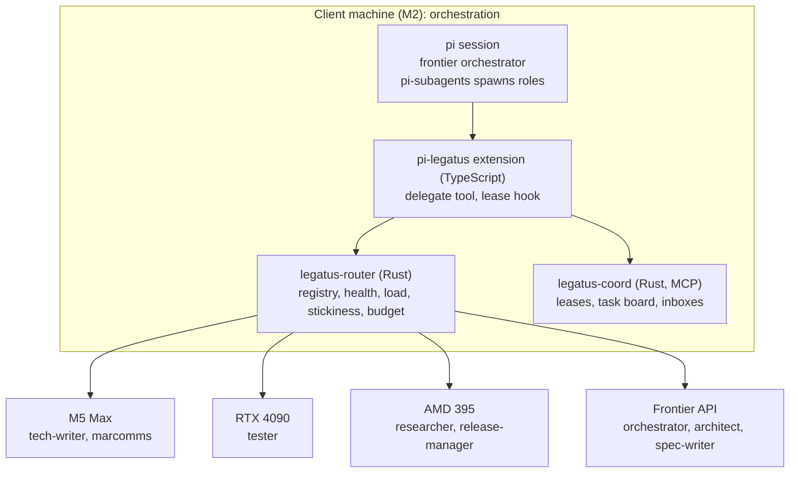

# Technical architecture

All orchestration runs on the client machine; other machines only serve inference. Four layers sit between the person and the models, with a coordination service alongside.

Role placements are first preferences; each role falls back down its candidate list.

## Layers

1. **Harness.** A pi session with a frontier model as orchestrator. pi-subagents spawns each role as an isolated pi process with its own model and permissions.
2. **Dispatcher.** The `delegate(role, task)` tool, a thin pi extension, asks the router which node should serve the role. See [dispatcher](dispatcher.md).
3. **Router.** `legatus-router`, a Rust OpenAI-compatible proxy, fronts every node and the frontier API: health checks, failover, frontier spend cap and session affinity. It replaces an interpreted gateway such as LiteLLM.
4. **Nodes.** Each machine runs whatever engine suits it (llama.cpp, MLX, vLLM, SGLang), optionally behind llama-swap or llama-server router mode for local model lifecycle, reachable by the router over the local network. The frontier API is just another node with a budget. An optional `legatus-node` agent reports health and load uniformly.

Alongside sits the **coordination service**, an MCP server every agent connects to for leases, a shared task board and messaging. See [coordination](coordination.md).

## Boundaries and protocols

| Boundary | Standard | Status |
| --- | --- | --- |
| Harness to model | OpenAI Chat Completions, Anthropic Messages | Works today |
| Agents to coordination | MCP | Build `legatus-coord` |
| Orchestrator to remote subagent | ACP over ssh (`pi-acp`) | Fork pi-subagents; unshipped |
| Repo instructions | AGENTS.md | Works today |
| Agent to independent agent | A2A v1.0 | Optional, later |

## Isolation

Every writing agent gets its own git worktree and branch; the release manager merges. Leases cover what worktrees cannot: shared environments, deployment and the release itself.

## Least privilege

The network is assumed to be a trusted local one; Legatus does not own network-level security. Within that, least privilege is enforced at the agent and resource level:

- Each role's `tools` profile is an allow-list; unlisted tools are denied.
- Leases cover the narrowest resource that works (a path glob, not the repo).
- The frontier API key is held by the router only. Agents never see it.
- A subagent receives only the leases and credentials its task needs, for the task's lifetime.

## Frontier budget

The frontier model sits behind the router with a daily spend cap. Behaviour when the cap is reached is defined in [dispatcher](dispatcher.md#frontier-budget-exhaustion). Outputs passed back to the orchestrator are pointers (branch, path, link), so frontier context grows slowly.

## Failure modes

Rule: when a safety-bearing component is unavailable, Legatus fails closed for writes and open for reads. It never bypasses the router or the lease check to keep work moving.

| Failure | Effect | Behaviour |
| --- | --- | --- |
| Router down | No model calls can be routed | `delegate` fails fast with a clear error. Agents do not call nodes directly, so stickiness and the budget cap still hold. Running subagents' calls fail and are reported as blocked. |
| Coord down | No lease checks possible | The lease hook blocks writes, commits and release commands; reads continue. New delegations are refused. See [coordination](coordination.md#lease-hook-failure-behaviour). |
| Coord store locked or corrupt | State may be inconsistent | Coord refuses writes and reports the error. Recovery replays the append-only event log; if the log is unreadable, restore the last backup taken at session start. |
| Coord restarts | In-memory state lost | State is rebuilt from the event log. Leases whose TTL lapsed during the outage are expired, never extended. |
| Node down or unhealthy | Requests to it fail | Per-node circuit breaker; see [dispatcher](dispatcher.md#circuit-breaker). |
| Frontier API down | Frontier calls fail | Treated as a node failure through the same circuit breaker. Roles with no other candidate block and report. |
| Client machine sleeps | Orchestration stops | All leases lapse by TTL. On wake, coord expires stale leases before any agent resumes. |

## Parameters

Named values used across these docs. Defaults are reasoned starting points, not measurements; tune them against the acceptance tests in the [roadmap](roadmap.md).

| Parameter | Default | Used for |
| --- | --- | --- |
| `LOAD_POLL_INTERVAL_S` | 2 | Queue and load polling |
| `HEALTH_POLL_INTERVAL_S` | 10 | Active node up/down polling. Secondary: request outcomes (passive detection) trip the breaker first. |
| `FAILOVER_MAX_S` | 30 | Longest allowed time from node failure to no new traffic reaching it |
| `CONNECT_TIMEOUT_S` | 5 | Connection to a node |
| `FIRST_TOKEN_TIMEOUT_BASE_S` | 30 | Fixed part of the time-to-first-token timeout |
| `FIRST_TOKEN_TIMEOUT_PER_1K_PROMPT_S` | 1 | Added per 1,000 prompt tokens, for slow prefill |
| `STREAM_IDLE_TIMEOUT_S` | 60 | Longest silence mid-stream before the request fails |
| `BREAKER_FAILURE_THRESHOLD` | 3 | Consecutive failures that open a node's breaker; a timeout counts as a failure |
| `BREAKER_COOLDOWN_S` | 30 | First wait before a probe |
| `BREAKER_COOLDOWN_BACKOFF_FACTOR` | 2 | Cooldown multiplier on each repeat opening |
| `BREAKER_COOLDOWN_MAX_S` | 300 | Cooldown ceiling |
| `BREAKER_PROBE_SUCCESSES` | 2 | Probe successes needed to close the breaker |
| `REQUEST_RETRY_LIMIT` | 1 | Retries of a failed request, on the next candidate |
| `LEASE_TTL_S` | 60 | Default lease lifetime |
| `LEASE_RENEW_FRACTION` | 1/3 | Hook renews when this fraction of TTL remains |
| `HOOK_CACHE_TTL_S` | `LEASE_TTL_S` × `LEASE_RENEW_FRACTION` | Maximum age of the hook's cached lease state |
| `NEGOTIATION_MAX_ROUNDS` | 4 | Messages between two agents about one resource before escalation |
| `SMOKE_CALLS` | 50 | Calls in the tool-call smoke test |
| `SMOKE_MIN_PASS` | 0.95 | Pass fraction required to join a role |
| `SMOKE_MIN_VALID_JSON` | 1.0 | Fraction of tool calls whose arguments must parse and match the schema |
| `SESSION_BUDGET_FRACTION` | 0.25 | Largest share of `budget_gbp_day` one session may spend |
| `OUTPUT_TOKEN_ESTIMATE_DEFAULT` | 8192 | Expected output when a role gives none; a role may override it |
